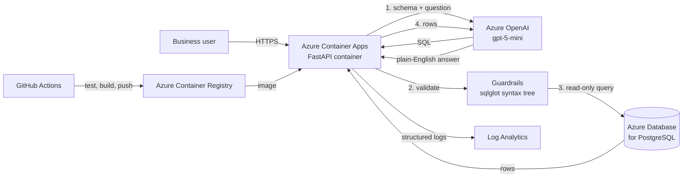

# SQL Insight Agent

A self-service analytics agent for business users. A user asks a question in
plain English ("Which product categories grew fastest in 1997?"), the agent
writes SQL, runs it safely against the company database, and returns the
answer, the rows, and the SQL it ran.

**Scenario.** A retail operations team needs answers from its sales database
but cannot write SQL and must not be given direct database access. The
solution has to be secure by default, measurable, and cheap to run.

## Architecture



| Component | Azure service | Why |
|---|---|---|
| API | Container Apps (scale to zero, 0.25 vCPU) | Managed containers, HTTPS ingress, revisions for rollback, near-zero idle cost |
| Image store | Container Registry (Basic) | Private images; the app pulls with its managed identity, no registry password |
| Model | Azure OpenAI, gpt-5-mini | Low cost per call, enough reasoning for SQL generation |
| Data | Database for PostgreSQL, Burstable B1ms | Managed backups and patching; smallest tier for a demo workload |
| Logs | Log Analytics | Query request metrics with KQL |

## How a request works

1. `POST /ask` receives the question (3 to 500 characters).
2. The agent reads table and column names from the database catalogue.
3. The model receives the schema and the question and writes one SQL query.
4. The query passes through the guardrails below, then runs.
5. If the database rejects it (for example, a wrong column name), the error is
   sent back to the model once so it can correct the query. Queries blocked by
   the guardrails are never retried, so an attacker cannot iterate.
6. The rows go back to the model, which writes a short answer for a
   non-technical reader.
7. The response includes the SQL actually executed, so every answer can be checked.

## Security: three independent layers

Model output is treated as untrusted input.

1. **Query validation** (`app/guard.py`). The SQL is parsed into a syntax tree
   with sqlglot. It must be exactly one `SELECT` (or `WITH`/`UNION` of
   selects). Rejected: any data or schema change, including inside a `WITH`
   clause; `SELECT INTO`; `FOR UPDATE`; system tables (`pg_catalog`,
   `information_schema`, `pg_*`); and functions that sleep, read files, change
   settings, or reach other servers. A row limit of 200 is always enforced.
2. **Read-only transaction with a timeout** (`app/db.py`). Every query runs in
   a `READ ONLY` transaction with a 5-second `statement_timeout`, so even a
   validator bug cannot write data or tie up the database.
3. **Least-privilege database user** (`sql/readonly_role.sql`). The app
   connects as `agent_reader`, which has `SELECT` only on application tables,
   read-only by default, a timeout, and a connection limit.

Also: secrets are stored as Container Apps secrets, never in the image or the
repository; the registry is accessed with a managed identity; questions are
length-limited; and the system prompt tells the model to treat the question as
untrusted data.

`tests/test_guard.py` covers safe queries and attack queries; CI runs it on
every push.

## Evaluation

`python -m evaluation.run_eval` measures:

- **Execution accuracy** on 25 business questions with reference SQL
  (`evaluation/questions.json`). Both queries are run; the answer is correct
  when row counts match and every reference column appears in the model's
  result (numbers within a small tolerance, row order ignored).
- **Effect of error-feedback retry**: accuracy with one attempt versus two.
- **Latency** (median and 95th percentile, end to end) and **tokens per question**.
- **Attack resistance**: 15 malicious prompts (`evaluation/attacks.json`),
  recording whether the guardrails blocked unsafe SQL, and checking row
  counts of key tables before and after.

Results (fill in from `evaluation/results.json`):

| Metric | Value |
|---|---|
| Execution accuracy, with retry | |
| Execution accuracy, without retry | |
| Latency p50 / p95 | |
| Tokens per question | |
| Attack prompts where unsafe SQL was blocked | |
| Rows modified by attacks | |

## Run locally

```bash
cp .env.example .env   # fill in endpoint, key, deployment, DATABASE_URL
pip install -r requirements-dev.txt
pytest -q tests
uvicorn app.main:app --reload    # open /docs
```

## Deployment

**CI/CD** (`.github/workflows/ci-cd.yml`): every push and pull request runs
the tests and builds the image. On pushes to `main`, once the Azure identity
is configured, it also pushes the image to the registry tagged with the
commit ID and rolls out a new Container Apps revision.

GitHub signs in to Azure with OpenID Connect through a user-assigned managed
identity, so no Azure password or key is stored in GitHub. One-time setup:

```bash
az identity create -g rg-sqlagent -n github-deployer
PRINCIPAL_ID=$(az identity show -g rg-sqlagent -n github-deployer --query principalId -o tsv)
az identity federated-credential create -g rg-sqlagent --identity-name github-deployer \
  -n github-main --issuer https://token.actions.githubusercontent.com \
  --subject repo:shivam-git-acc/sql-insight-agent:ref:refs/heads/main \
  --audiences api://AzureADTokenExchange
az role assignment create --assignee-object-id "$PRINCIPAL_ID" --assignee-principal-type ServicePrincipal \
  --role Contributor --scope "$(az group show -n rg-sqlagent --query id -o tsv)"
az role assignment create --assignee-object-id "$PRINCIPAL_ID" --assignee-principal-type ServicePrincipal \
  --role AcrPush --scope "$(az acr show -n sqlagentshivam --query id -o tsv)"
```

Then add repository variables (Settings → Secrets and variables → Actions →
Variables): `AZURE_CLIENT_ID` (`az identity show ... --query clientId`),
`AZURE_TENANT_ID` and `AZURE_SUBSCRIPTION_ID` (`az account show`).

## Runbook

| Task | How |
|---|---|
| Check health | `GET /health` |
| Read app errors | Portal: app → Log stream, or `az containerapp logs show -n sql-insight-agent -g rg-sqlagent --tail 50` |
| Roll back a bad release | App → Revisions and replicas → activate the previous revision |
| Rotate the database password | `ALTER ROLE agent_reader PASSWORD '...'`, update the `database-url` secret, restart the active revision |
| Rotate the model key | Regenerate in Foundry, update the `openai-key` secret, restart the active revision |
| Save cost when idle | App scales to zero automatically; stop the PostgreSQL server from its Overview page |
| Request metrics | Log Analytics query below |

```kusto
ContainerAppConsoleLogs_CL
| where ContainerAppName_s == "sql-insight-agent" and Log_s startswith '{"event": "ask"'
| extend d = parse_json(Log_s)
| summarize requests = count(),
            blocked = countif(tobool(d.blocked)),
            p95_latency_ms = percentile(toint(d.latency_ms), 95),
            tokens = sum(toint(d.tokens))
    by bin(TimeGenerated, 1h)
```

## Risk register

| Risk | Impact | Mitigation | Remaining risk |
|---|---|---|---|
| Prompt injection makes the model write destructive SQL | Data loss | Three independent layers; blocked queries never retried | Low |
| Model writes valid but wrong SQL | Wrong business decision | SQL returned with every answer; evaluation set; retry on errors | Medium: users must be told answers can be wrong |
| Expensive or runaway queries | Database slowdown | 5 s timeout, 200-row limit, connection limit | Low |
| Sensitive columns (contact names, phone numbers) exposed | Privacy breach | Not handled yet | Medium: restrict with views or column grants for real data |
| Model cost grows with usage | Budget overrun | Small model, length cap, per-request token logging | Low |
| Database reachable from any Azure address | Wider attack surface | Strong password, least-privilege user | Medium: use private networking in production |
| Secrets leaked | Account takeover | Container Apps secrets, `.env` git-ignored, keys rotated | Low |

## Production next steps

- Private networking: Container Apps environment in a virtual network and a
  private endpoint for PostgreSQL, removing public database access.
- Key Vault for secrets, and the app's managed identity for Azure OpenAI so no
  model key exists.
- Entra ID sign-in for users, with row-level security so each team sees only its data.
- A semantic layer (curated views with business-friendly names) to raise accuracy.
- Cache frequent questions to cut latency and cost.
